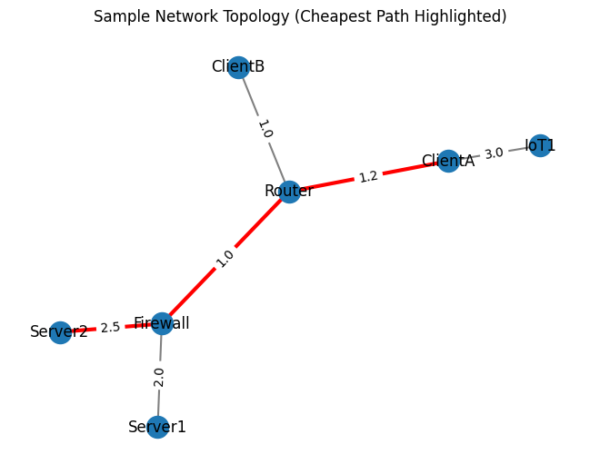

# Graph-Based Network Mapper & Packet Parsing Tree Simulator

A network security analysis simulation tool that demonstrates:
- **Tree data structures** for packet protocol encapsulation (Ethernet → IP → TCP/UDP → Application)
- **Graph data structures** for network topology mapping (devices as nodes, links as edges)
- Algorithms implemented from scratch:
  - BFS (shortest path in unweighted networks)
  - DFS (network exploration)
  - Cycle detection (topology risk / loop detection)
  - Dijkstra (optional weighted routing)

## Features
### Packet Parsing Tree
- Models protocol encapsulation as a hierarchical tree
- Traversal outputs a readable layer-by-layer parse

### Graph-Based Network Mapper
- Adjacency-list graph implementation (self-built)
- BFS shortest path discovery
- DFS exploration ordering
- Cycle detection for loops
- Dijkstra for weighted routing

## Complexity
- Tree traversal: **O(n)** where *n* is number of protocol nodes
- BFS: **O(V + E)**
- DFS: **O(V + E)**
- Cycle detection (DFS-based): **O(V + E)**
- Dijkstra (binary heap): **O((V + E) log V)**
## Network Topology Visualization

The tool can render the network graph and highlight the **cheapest path** computed using **Dijkstra’s algorithm**.

- **Nodes** = devices (router, firewall, servers, clients, IoT)
- **Edges** = connections
- **Edge labels** = weights (cost/latency/risk)
- **Red edges** = cheapest path (Dijkstra)



## How to Run
Create venv (optional) then install deps:
```bash
pip install -r requirements.txt
